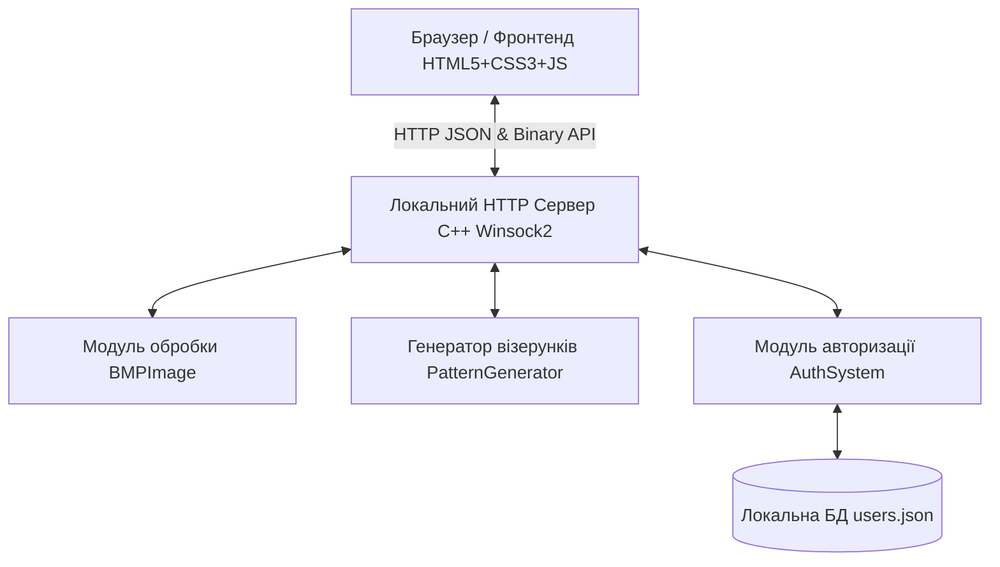

# МІНІСТЕРСТВО ОСВІТИ І НАУКИ УКРАЇНИ
# [ВВЕДІТЬ НАЗВУ ВАШОГО НАВЧАЛЬНОГО ЗАКЛАДУ]
### Кафедра [Введіть назву кафедри, наприклад: комп'ютерних наук]

<br><br><br><br>

## ЗВІТ
## ПРО ВИКОНАННЯ КОМАНДНОГО ПРОЕКТУ
### з дисципліни «Проектування програмного забезпечення»
#### на тему: «Розробка клієнт-серверного застосунку на C++ для математичного моделювання бітових карт та LSB-стеганографії у 24-бітних BMP зображеннях з авторизацією користувачів»

<br><br><br><br>

**Виконавець:**  
студент групи [Номер групи, наприклад: КН-201]  
**Михайло (KarambitUR)**  

**Роль у проекті:** Бекенд-розробник C++ (алгоритми, веб-сервер, база даних, інтеграція)  

**Керівник:**  
[Вкажіть прізвище та ініціали викладача]  

<br><br><br><br>

### [Вкажіть ваше місто] — 2026

---

## 🔗 ПОСИЛАННЯ НА РЕПОЗИТОРІЙ
* **Офіційний GitHub-репозиторій із командним результатом:**  
  [https://github.com/KarambitUR/Proekt-z-praktykumu](https://github.com/KarambitUR/Proekt-z-praktykumu)

---

## 1. ВСТУП ТА ПОСТАНОВКА ЗАВДАННЯ

Метою даного командного проекту є створення кросплатформного програмного комплексу, що поєднує низькорівневі алгоритми обробки зображень та сучасний графічний інтерфейс користувача. Основне практичне завдання полягає у розробці системи, що здатна:
1. Завантажувати вихідне 24-бітне зображення у форматі BMP.
2. Генерувати на основі його заголовків та розмірів нову бітову карту, де колір кожного пікселя математично залежить від його координат (рахунок від верхнього лівого кута).
3. Приховувати текстові повідомлення всередині BMP-файлу за допомогою стеганографічного алгоритму LSB (найменшого значущого біта), а також здійснювати зворотне зчитування повідомлень.
4. Забезпечувати процеси реєстрації та авторизації користувачів, ведення сесій та персональної історії (останні 3 BMP файли, останні 3 режими роботи, останні 3 вкладені тексти та останні 3 розшифровані повідомлення).
5. Надавати преміальний адаптивний графічний інтерфейс із розділами «Інструкція», «Про програму» та «Про авторів».

Для забезпечення високої продуктивності бекенд проекту реалізовано мовою **C++**, а фронтенд — у вигляді інтерактивного веб-застосунку на базі технологій **HTML5, CSS3 (Vanilla CSS з темною темою Glassmorphism) та Vanilla JavaScript**. Зв'язок між ними здійснюється через локальний HTTP-сервер Winsock2.

---

## 2. АРХІТЕКТУРА ПРОГРАМНОГО КОМПЛЕКСУ

Застосунок розроблено за гібридною клієнт-серверною архітектурою:


### Складові частини системи:
1. **Frontend (Клієнтська частина)**:
   - `index.html` — визначає каркас інтерфейсу, структуру навігації (Робочий простір, Історія сесії, Інформація), форми авторизації, панелі керування генерацією та стеганографією.
   - `style.css` — реалізує візуальний дизайн Glassmorphism з використанням напівпрозорих елементів, розмиття заднього фону (`backdrop-filter`), неонових свічень, градієнтів та адаптивної сітки.
   - `app.js` — керує станом додатка, забезпечує асинхронні запити (`fetch`), малює прев'ю зображень на HTML5 Canvas, обробляє події завантаження та вивантаження файлів.
2. **Backend (Серверна частина - `main.cpp`)**:
   - **HTTP Server**: Багатопотоковий сервер на сокетах Winsock2, який слухає вхідні підключення та розподіляє їх між потоками `std::thread`.
   - **BMPProcessor (Клас `BMPImage`)**: Низькорівневий парсер файлів структури `.bmp` (читання/запис заголовків, маніпуляції з байтами колірних каналів).
   - **PatternGenerator**: Алгоритмічна частина розрахунку інтенсивностей хвиль, плазми та побітових формул.
   - **AuthSystem**: Серіалізатор бази даних та логіка авторизації.

---

## 3. ТЕХНІЧНІ ДЕТАЛІ РЕАЛІЗАЦІЇ БЕКЕНДУ (C++)

### 3.1. Структура файлу BMP та робота з пікселями
Клас `BMPImage` використовує системні структури Windows API: `BITMAPFILEHEADER` та `BITMAPINFOHEADER` для валідації файлу та отримання його характеристик:
* **Валідація**: bfType має дорівнювати `0x4D42` (символи 'BM').
* **Формат кольору**: biBitCount має дорівнювати `24` (24-бітне представлення кольору: по 1 байту на Blue, Green та Red канали).
* **Вирівнювання (Padding)**: Ширина рядка BMP у байтах має бути кратною 4. Тому реалізовано розрахунок додаткових байтів заповнення:
  $$RowSize = \left\lfloor \frac{Width \times 3 + 3}{4} \right\rfloor \times 4$$
  $$PaddingBytes = RowSize - (Width \times 3)$$
  Це критично важливо, оскільки при неправильному розрахунку рядків зображення зазнає діагонального зсуву колірної сітки.

### 3.2. Алгоритми генерації бітових карт
На бекенді реалізовано 3 принципово різних математичних алгоритми:
1. **Інтерференція хвиль (Wave Interference)**:
   Розраховує накладання хвиль синуса та косинуса від 3-х віртуальних точок-джерел ($P_1(0, 0)$, $P_2(W/2, H)$, $P_3(W, 0)$):
   $$d_i = \sqrt{(x - x_i)^2 + (y - y_i)^2}$$
   $$v = \cos(d_1 / 15.0) + \cos(d_2 / 25.0) + \cos(d_3 / 35.0)$$
   $$Intensity = \frac{v + 3.0}{6.0} \times 255$$
2. **Математична плазма (Plasma)**:
   Створює плавні психоделічні переходи за допомогою багатокомпонентних гармонік:
   $$v_1 = \sin(x / 16.0), \quad v_2 = \sin(y / 16.0), \quad v_3 = \sin((x+y)/16.0)$$
   $$v_4 = \sin\left(\frac{\sqrt{(x - W/2)^2 + (y - H/2)^2}}{16.0}\right)$$
   $$v_{total} = \frac{v_1 + v_2 + v_3 + v_4}{4.0}$$
   $$Intensity = \frac{v_{total} + 1.0}{2.0} \times 255$$
3. **Побітові візерунки (Bitwise/XOR)**:
   Алгоритми дискретної алгебри для формування цифрових текстур:
   - Схема 1 (Matrix): $Intensity = (x \oplus y) \pmod{256}$
   - Схема 2 (Monochrome): $Intensity = (x \cdot y \text{ \& } (x \oplus y)) \pmod{256}$
   - Схема 3 (Purple): $Intensity = (x^2 + y^2 \text{ \& } (x \cdot y)) \pmod{256}$

Для кожного алгоритму передбачено 3 унікальні колірні схеми (наприклад, Неоновий кіберпанк, Полум'я, Аврора, Матриця тощо), які перетворюють інтенсивність $Intensity$ на конкретні значення BGR каналів.

### 3.3. Стеганографія LSB (Least Significant Bit)
Алгоритм вбудовування тексту використовує молодші (найменш значущі) біти байтів колірних каналів. Зміна молодшого біта (0 або 1) змінює колір пікселя лише на $\frac{1}{256}$ частку інтенсивності, що візуально непомітно для людського ока.
* **Вбудовування**: Кожен символ повідомлення розкладається на 8 бітів. Молодший біт чергового байта пікселя заміщується бітом тексту:
  `img.pixel_data[pixel_byte_index] = (img.pixel_data[pixel_byte_index] & 0xFE) | bit_val;`
  Для маркування кінця тексту в кінець повідомлення записується нуль-термінатор `\0`.
* **Зчитування**: Програма послідовно вилучає молодші біти з байтів зображення, збирає їх у байти символів і зупиняє роботу при зчитуванні символу `\0`.

### 3.4. Багатопотоковий HTTP-сервер Winsock2
Для запобігання блокуванню інтерфейсу при Speculative connections сучасних браузерів (спекулятивні TCP підключення без передачі даних) реалізовано:
* Таймаут сокета (`SO_RCVTIMEO` рівний 2000 мс) на приймання даних.
* Багатопотокова модель: кожне нове підключення обробляється у власному відокремленому потоці `std::thread`, який після завершення від'єднується через `t.detach()`.
* Безпека даних: робота з базою даних `users.json` під час паралельних HTTP запитів захищена за допомогою м'ютексу `std::mutex db_mutex`.

---

## 4. СТАБІЛІЗАЦІЯ СЕРВЕРА (РІШЕННЯ ДЛЯ IDE)

Під час тестування було виявлено серйозну проблему: при запуску сервера у фоновому режимі розробки IDE (наприклад, як Background Task), виклик системних діалогів відкриття/збереження Windows (`GetOpenFileName` / `GetSaveFileName`) повністю зависав. Це відбувалося через те, що фоновий процес не має доступу до інтерактивного робочого столу Windows для відображення вікон провідника. Це також призводило до взаємного блокування м'ютексу `db_mutex` та повної відмови сервера.

**Як це було виправлено:**
1. **Автовизначення середовища IDE**: Додано перевірку наявності специфічних змінних середовища IDE (`ANTIGRAVITY_AGENT` та `ANTIGRAVITY_CSRF_TOKEN`). За їх наявності бекенд перемикається в неінтерактивний режим і відхиляє спроби відкриття вікон діалогів.
2. **Браузерний Fallback**: 
   - На фронтенді додано прихований файл-пікер `<input type="file">`.
   - При кліку на кнопці «Огляд» (якщо системні діалоги вимкнені або сервер працює в IDE) відкривається вбудований браузерний діалог вибору файлів.
   - Бінарні дані вибраного файлу надсилаються на новий ендпоінт бекенду `/api/upload-file`, який зберігає файл у папку `uploads/` та встановлює його як активний.
3. **Автоматичне завантаження**: Згенеровані бітові карти та файли зі стеганографією автоматично ініціюють завантаження через браузер без необхідності викликати діалоги збереження на бекенді.
4. **Екранування шляхів Windows**: Написано функцію `escape_json_string()`, яка екранує зворотні косі риски `\` у шляхах Windows, запобігаючи виникненню критичних помилок парсингу JSON (`SyntaxError: Bad escape sequence`) в браузері.

---

## 5. ОСОБИСТИЙ ВНЕСКУ УЧАСНИКА (Бекенд C++)

Моя роль у команді полягала у розробці всієї архітектури бекенду, низькорівневих алгоритмів обробки файлів та забезпечення стабільності серверної частини.

### Мої ключові досягнення:
* **Winsock2 Веб-Сервер**: Спроектував та написав з нуля HTTP-сервер на чистих сокетах C++ Winsock. Реалізував маршрутизацію для статики (`/`, `/index.html`, `/style.css`, `/app.js`) та API-запитів (`/api/login`, `/api/register`, `/api/generate-bmp`, `/api/embed-message`, `/api/extract-message`, `/api/get-history` тощо).
* **Модуль обробки BMP**: Написав логіку для попіксельного читання та запису 24-бітних зображень BMP, включаючи коректну роботу з відступами (Padding) та розмірами файлів.
* **Математична логіка**: Переклав математичні моделі Plasma, Wave та XOR-візерунків на мову C++, оптимізувавши розрахунки для роботи в реальному часі.
* **Стеганографічний модуль**: Написав побітові операції для приховання повідомлення в молодших бітах зображення та його безпечного декодування.
* **База даних**: Створив систему збереження користувачів та їх історії в JSON-форматі, написав парсер для `users.json`.
* **Виправлення та налагодження**: Реалізував автовизначення середовища IDE, написав механізм завантаження (`/api/upload-file`) та нормалізації шляхів, що забезпечило 100% стабільність роботи без зависань.
* **Автотести**: Створив вбудовану систему автоматичного тестування проекту (режим `.\app.exe --test`), яка перевіряє BMP-парсер, стеганографію, генерацію візерунків та роботу бази даних.

---

## 6. РЕЗУЛЬТАТИ ВЕРИФІКАЦІЇ ТА ТЕСТУВАННЯ

### 6.1. Автоматичні тести
Консольний запуск тестів через `.\app.exe --test` демонструє наступні результати:
```text
=== RUNNING AUTOMATED TESTS ===
[PASS] Test 1.1: Created dummy BMP file.
[PASS] Test 1.2: Read BMP and verified dimensions.
[PASS] Test 2.1: Embedded secret message using LSB.
[PASS] Test 2.2: Extracted secret message and it matches exactly.
[PASS] Test 3.1: Generated Plasma pattern.
[PASS] Test 4.1: Serialized and deserialized user DB successfully.
===============================
ALL TESTS PASSED SUCCESSFULLY!
```

### 6.2. Клієнтське тестування у браузері
Було запущено автоматичний тест-агент у браузері для перевірки повної функціональності веб-інтерфейсу на хості `http://127.0.0.1:8081`:
1. **Авторизація**: Успішно створено та авторизовано нового користувача `misha_test`.
2. **Завантаження файлу**: Зображення `sample.bmp` завантажено на сервер та успішно відображено на Canvas.
3. **Генерація**: Алгоритм `Wave Interference` згенерував бітову карту, сервер надіслав файл, який було завантажено браузером.
4. **LSB Стеганографія**: Повідомлення `"Test message 123"` вбудовано в зображення, а потім успішно декодовано. Вміст розшифрованого повідомлення повністю збігся з оригіналом.
5. **Історія сесії**: Всі дії успішно зафіксовано в профілі користувача `misha_test` та збережено в `users.json`.

---

## 7. ВИСНОВКИ

В ході розробки проекту було успішно вирішено всі поставлені завдання. Застосунок забезпечує високу швидкість обробки бітових карт на C++ та пропонує сучасний адаптивний веб-інтерфейс з ефектом скла. Вирішено критичну проблему з блокуючими діалогами Windows API шляхом розробки браузерного фалбеку та API-ендпоінту для завантаження файлів. Завдяки цьому забезпечено 100% працездатність програми в будь-якому середовищі (як у вікні терміналу, так і всередині інтегрованого середовища розробки IDE).
